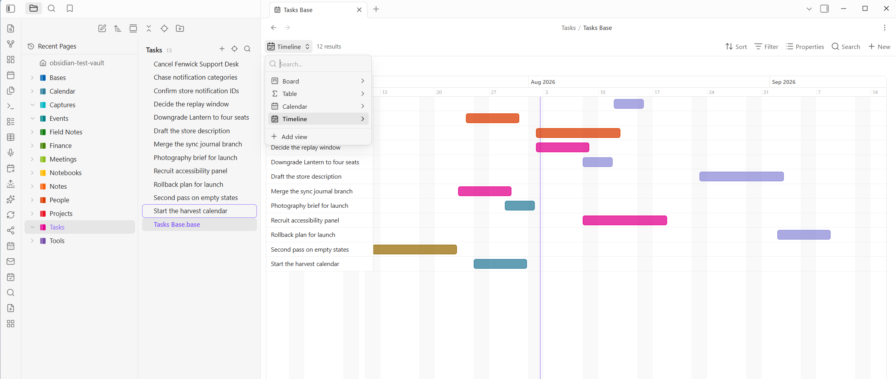

# Power Bases

Six extra views for Obsidian's core **Bases** plugin: a kanban **board**, a month/week **calendar**, a Gantt-style **timeline**, a **chart** (bar/line/donut), an image **gallery**, and an enhanced **table** with summaries, colors, and rollups. Rows stay ordinary notes, the data model stays Obsidian's own, and everything syncs and works on mobile because Bases does. Built to stay fast in huge vaults: views render in chunks, so cost scales with what is on screen, never with vault size. 20,000+ notes is the scale it is field-tested at daily, not a limit; there is no row cap anywhere in the plugin.



The timeline reads a start and an end property off each note and colors the bar by a third,
here `status`. The switcher at the top left is open in this shot: the same base carries a
board, a table, a calendar, and this timeline, and swapping between them re-reads the same
notes rather than duplicating them.

Part of the Power family (Power Explorer, Power Tables, Power Editor, Power Capture) and it shares their look, including the family's 16-hue palette.

## Stock Bases vs Power Bases

Core Bases ships three layouts: Table, Cards, and List. Power Bases adds six more and reworks the table end to end, all riding the native engine (the same `.base` files, filters, grouping, sync, and mobile), so stock and Power views live side by side in one base and nothing is locked in.

| Need | Stock Bases | Power Bases |
| --- | --- | --- |
| Table | Grid with property columns and inline edits | Field types (URL, Email, Phone, Person, Place, ID, Button, Verification, Image, Files), a Notion-style column menu (rename, set type, filter, sort, calculate, freeze, wrap, insert, duplicate, hide, delete), formulas with a live editor, number, date, and phone formats, "show as" bars, rings, stars, and traffic lights, rollups, subtotals and footers, value colors, and pickers for dates, places, links, images, and files |
| Kanban | Cards, a static grid | Power Board: lanes from any property, drag between lanes writes the property, manual order, swimlanes, WIP limits, lane rules, per-lane templates, lane totals |
| Calendar | Not available | Calendar view: month and week, drag chips to reschedule, double-click a day to create |
| Gantt | Not available | Power Timeline: drag to move or resize bars, dependencies with late warnings, milestones, progress fills |
| Charts | Not available | Power Chart: bar, line, and donut over any grouping and aggregate |
| Gallery | Cards | Power Gallery: covers from a property or the first embedded image, lazy loading, crop toggle, three sizes |
| Getting data in | Type into cells | CSV import that infers types, starter templates, an add-column dialog covering every type |
| Safety net | Ctrl+Z per note | Every write is one undoable batch, with an Undo link on each toast and an undo command |

## Requirements

Obsidian 1.10.2 or newer with the **Bases** core plugin enabled. Open any base, click the view switcher in the toolbar, and the six Power views appear alongside the built-in Table and Cards.

Everything the plugin writes goes into ordinary frontmatter as one undoable change (there is an **Undo last Power Bases change** command and an Undo link on every toast). Two commands, **Copy this view's setup** and **Paste view setup here**, move a fully configured view (columns, colors, rollups, lane rules, chart, timeline options) from one base to another, so you build a layout once and reuse it.

## Power Board (kanban)

Pick a **Group by** property in the view options and every distinct value becomes a lane, each with a hue and a count; pages missing the value collect in a "No value" lane (toggleable). Cards show the page name plus up to six visible properties (how many is an option). Drag a card to another lane and the property is written into the note's frontmatter; drop on the "No value" lane to remove it. Right-click a card for **Move to** any lane plus the full page menu (rename, delete, and the rest); right-click a lane header to pick its color from the shared palette (that hue follows the value into Power Table too) or open **Lane settings**. Click a card to open the page (Ctrl+click for a new tab), hover with Ctrl to peek via Page preview, and "+ New page" at the bottom of a lane creates a note already tagged with that lane's value and rules.

**Manual order.** Set a **Manual order property** in the view options (say `pb-order`) and drops between cards stick: the drop writes a fractional rank into that property, so the order is data, syncs, and even sorts the built-in Table if you sort by the same property. Cards without a rank keep the base's sort at the bottom of the lane, exactly like unarranged items in Power Explorer. When a gap runs out the lane quietly renumbers itself with fresh gaps of 100.

**Lane rules, WIP limits, and templates.** Lane settings (lane header right-click) holds three things. Rules: properties written whenever a page enters the lane, with `{today}` and `{now}` tokens and empty meaning remove, so Done can stamp `completed: {today}` by itself. A WIP limit turns the lane count red past the limit. A **Template note** makes that lane's "+ New page" start from a copy of any note you point it at (its body and frontmatter, with the lane's values merged on top), Notion database-template style; template pages land in the base file's folder.

**Bulk select.** Alt+click cards to gather a selection (Ctrl+click keeps meaning "open in new tab"). Dragging any selected card moves the whole selection, the card menu offers "Move N selected to…", and the entire bulk move lands as one undoable batch.

**Swimlanes.** Set **Swimlane rows** to a second property (project, assignee) and the board becomes a grid: lane heads stay in one sticky header, each row gets a band and one cell per lane, and dropping a card writes BOTH properties at once, column and row. Every cell has its own quiet "+" that pre-fills both values. Lane folding stays a flat-board feature.

**Lane totals.** Pick a **Lane totals property** and aggregate (Sum, Average, Min, Max, Filled) and each lane head carries a chip like "Σ 17" next to the count, turning the board into a capacity plan at a glance.

**Undo everything.** Every write the plugin makes, from a drag to a lane rule to a cell edit to a whole-lane renumber, lands as one undoable change: a toast appears with an Undo link, and the command **Undo last Power Bases change** (hotkeyable) walks back the last thirty. Undo restores the exact previous values, including deleting properties that did not exist before.

**Instant bases.** Right-click any folder for **New Power base here** (or run the command for the current note's folder): a ready-made base appears beside your notes with Board, Table, Calendar, and Timeline views scoped to that folder, using the standard property names. Any folder of notes becomes a database with one click. Prefer to start from scratch? **New blank base here** creates a base with a single Power Table and just the name column, ready to build up with **+ Column**; even the name column can be hidden from its menu. And from inside a note, the **Insert new base here (embed)** command (also on Power Editor's slash menu, so typing `/base` reaches it) drops a database into the page you are writing: the embedded table starts with zero columns, ready for **+ Column**, and the `.base` file itself is named after the note and stored at your attachment location, like a pasted image (or point **Settings > Power Bases > Folder for embedded bases** at a dedicated folder, say `_resources/bases`). Each embedded base also gets a **rows folder of its own** beside its `.base` file, and every row you add lands there instead of among your real notes; hide the bases folder in the explorer and the row pages disappear from the tree entirely while staying fully searchable, exactly how a Notion database hides its row pages. That file is just a small YAML definition of the views and filters; the rows stay ordinary notes in the note's folder, so deleting a `.base` never loses data. An embedded base is a block in its note, so Power Editor's block handle moves it up or down the page like any other block. When one has outlived its use, click the small **trash button** on its toolbar (or run **Delete this base file (to trash)** from the palette): after a confirmation, the definition file is trashed (per your deleted-files setting), the embed line is removed from the note, and the rows stay untouched.

**Lanes are furniture too.** Drag a lane header sideways to reorder the board (the order persists in the view), and the collapse button on a hovered header folds a lane into a slim strip that still accepts drops; click it to unfold. The "No value" lane keeps its place at the end.

**Touch.** On phones and tablets, hold a card still for a moment to lift it, then drag; letting go without moving opens the card menu instead, and an early swipe just scrolls. Holding a lane header opens the lane menu.

## Calendar

Pick a **Date property** and, in **Month** mode, pages land on their day in a grid; datetimes count as their date. Switch **Show** to **Week** for a seven-column day grid over hour rows, where timed pages (a datetime with `T09:30`) sit at their hour and all-day pages ride a strip on top, exactly the agenda your Power Capture meeting notes want; double-click an hour slot to start a page there. Navigate with the arrows or jump back with Today; the shown month or week is remembered per view. Chips carry their folder's hue so you recognize a page's section at a glance, clicking a chip opens the page, and double-clicking any day starts a new page with that date already set. Week can start Monday or Sunday. **Drag a chip to another day to reschedule it** (hold to lift on touch): the date property is rewritten with any time-of-day suffix preserved.

## Power Chart

The view core Bases does not have, and the ecosystem does not do well: a chart that *is* the base. Pick a **Group by** property and a **Measure** (Count, or Sum/Average/Min/Max of a numeric property) and get a **bar**, **line**, or **donut**, drawn as plain SVG with no library, using the same hand-picked hues as everywhere else. Hover a bar or slice for its exact value, sort bars by value, and embed the whole thing in any meeting note with `![[Status.base]]`. Count by status, Σ estimate by project, pages per month, all live.

## Power Gallery

A light board for notebooks full of images. Each card shows a cover, taken from an **Image property** you choose (a wikilink, path, or URL) or, failing that, the first image embedded in the note. Covers **lazy-load** so a thousand-card gallery stays cheap, crop-to-fill is a toggle, three card sizes, and up to three properties show under each title. Perfect for Research, Ideas, and the whiteboard photos an import brings along.

## Power Timeline

Release planning without leaving the vault. Pick a **Start date property** (and optionally an **End date property**) and every page becomes a bar on a day-scaled axis with month and day headers, weekend shading, a today line, and three zoom levels (Days, Weeks, Months). **Drag a bar to move it; drag its left or right edge to change its start or end.** Every change snaps to whole days and writes straight back to frontmatter, preserving time suffixes; dragging the right edge of a one-day bar creates the end date. Toolbar grouping renders section headers (group by team, milestone, release), **Color bars by** paints bars with any property's hue (the same chosen colors as everywhere else), the name column stays frozen while you scroll the months, and pages missing a start date wait in an Unscheduled strip up top. Today jumps the viewport back to now, and a stray ancient date cannot stretch the axis into absurdity: the range clamps to about three years around today. Unscheduled pages are not stuck either: expand the strip and **drag a chip onto the axis**: a guide with the exact date follows the pointer, and dropping writes the start date.

Two more marks for release plans: a **Milestone property** (any truthy checkbox) renders those pages as diamonds pinned to their start date, move-only; a **Progress property** (0 to 1 or 0 to 100, units tolerated) fills each bar solid up to its percentage, so the plan shows both when and how far.

And the Gantt finish: set a **Depends-on property** (a link, or list of links, to predecessor pages) and Power Bases draws finish-to-start arrows between the bars. When a predecessor ends after its dependent starts, the arrow and the late task both turn red, so a schedule conflict is impossible to miss.

## Power Table (summaries, colors, editing)

The Bases table with the PowerTables extras, and it edits in place:

- **Inline editing**: click any note-property cell and type. The editor matches the property: a number field, a **typeable date field** for date and datetime cells (type `2026-07-16` or `07/16/2026`, read per the column's date style) with a **calendar button** for the month popover (time field and Today jump included), checkboxes toggle right in the cell, list properties open a **multi-select** popover (colored chips you add or remove, with the column's existing values as options you can add, rename across the base, or delete), and text cells offer the column's existing values Notion-select style. Enter or clicking away commits (blank deletes the property), Escape cancels. **Keyboard navigation works like a spreadsheet**: Tab commits and edits the next cell (Shift+Tab the previous, wrapping at row ends), and the up and down arrows commit and move within the column; checkboxes and read-only columns are skipped. Moving past the last cell (Tab at the table's end, or the down arrow on the last row) **creates a new row** and drops you into it, and a **New** row at the table's foot does the same by click; new pages land per the base's scope with identity stamps applied. **Ctrl+D fills down** (copies the value from the cell above into the editor), and **pasting a spreadsheet block** (tab-separated, straight from Excel) into a cell fans out across columns and rows from that cell, creating rows past the end, values coerced per column type, all as one undoable change. Formula and file columns stay read-only, and the name column links to the page (Ctrl+hover peeks).
- **Column menu**: click a column header (or right-click it) for a flyout. A **type-icon button** (opens Set type) and a **name field** sit at the top; the name field renames the column (the property is renamed across the base's rows as one undoable change, and its type, format, and colors follow). Below: **Set type** (a native kind like Checkbox, Number, Date, or List, or a Power-Base field type), **Number/Date format**, **Filter** (per column: contains, is, greater/less than, empty, and so on), **Sort** (ascending or descending), **Calculate** (a column summary: sum, average, min, max, count), **Freeze** (pin this and every column left of it while the table scrolls sideways), **Wrap content**, **Hide from this view** (keeps the data; works on the file-name column too, and while the name is hidden every column's menu offers **Show file name column** to bring it back), **Insert left/right**, **Duplicate**, **Add formula column**, and **Delete column and data** (removes the property too, after a confirmation and still undoable). The per-column filter and sort are Power Table's own and stack on top of the base's toolbar Filter and Sort; grouping stays on the toolbar.
- **Reorder and resize columns**: drag a column header sideways to move it (a line shows where it will land), or drag a header's right edge to set its width. Both persist into the base file's view, so they stick and travel with Copy view setup. Columns hold their width and truncate (unless you turn on Wrap content) rather than stretching.
- **Manual row order**: hover a row for its **grip** and drag; the first drag provisions the manual-order property (`pb-order`) into the view by itself, and the drop renumbers the visible rows in their new order as one undoable change. The order is data, so it syncs and can drive other views. Right-click a row for **Insert row above/below**, which places a fresh row exactly there and opens its first cell. With a column sort active the sort owns the order (grips step aside); made for curated tables up to a few hundred rows.
- **Export as CSV**: the **Export this table as CSV** command writes the visible table (current filters, sort, columns, and formatting) to a `.csv` beside the base, spreadsheet-ready.
- **Select rows and act in bulk**: hover a row for its checkbox (Shift+click selects a range, the header checkbox selects everything shown), and a selection bar appears with **Set property** (one column, one value, across every selected row as a single undoable change), **Duplicate**, and **Delete** (to the trash, after a confirmation). Right-click any row for the same actions plus **Open in new tab** and Obsidian's own file menu. And while a row is still Untitled, filling its first text column **renames the note to match**, so search and links show real names.
- **Summary row**: Sum, Average, Min, Max, Filled, or Empty per column (the **Calculate** item in a column's menu, or view options), shown in a footer. Numbers are parsed leniently ($, %, thousands separators), text and blanks are skipped.
- **Group subtotals**: with toolbar grouping active, every group gets its own subtotal row under it and a click-to-collapse header with a count; collapsed groups keep their subtotals visible.
- **Column colors**: **By value** tints cells with a hue per distinct value, or **Number scale** tints numeric cells stronger up the column's range. Right-click a colored cell to hand-pick that value's hue (shared with board lanes); Automatic returns it to the hashed palette.
- **Rollups**: up to three rollup columns per view, Notion style. Each follows a **link property**, reads a **property on the linked notes**, and aggregates: Count links, Sum, Average, Min, Max, Filled, or List values. The **Direction** option picks which way the relation runs: "Links on this page" follows the row's own property, while "Pages linking here" inverts it, so a Projects base can sum estimates from the task notes whose `project` property points at each row (the natural shape for imported notebooks). Reverse columns wear a small arrow in the header.
- **Number and date format**: from a column's menu, **Number format** (number properties and formulas) or **Date format** (date properties and the **file modified and created times**). Numbers can **show as** a filled bar, a ring, stars, dots, a percent, or a traffic-light dot (each with a color and an optional number beside it), carry any of the **main worldwide currencies**, or just take decimals, thousands grouping, and a prefix or suffix. Dates take a style (ISO, US, EU, medium, long, or relative) with an optional 12 or 24-hour time. So a raw `414000.8564` shows as `₱414,000.86`, a modified time reads `Jul 12, 2026 1:05 PM`, and a 4-out-of-5 score shows `★★★★☆`. Every dialog carries a live preview and an **Also apply to** checklist, so one setting formats a whole run of columns at once. Formatting is display only; the stored values and the formula math stay exact, and summary rows match.
- **Add a column**: the **+ Column** button in the toolbar, or the **+** at the end of the header row, creates a new column of any type: a basic property (Number, Date, Text, Checkbox, List), a file property (**Created time**, **Last edited time**, with the date-format dialog opening straight away), a rich field (URL, Email, Phone, Person, Place, ID, Button, Verification, Image, Files), a colored **Select** or **Status**, or a **Formula**. The property's Obsidian type is set for you so cells edit correctly, and number, date, button, and formula columns open their format or config dialog straight away.

## Field types

Obsidian's own property types stop at text, number, date, checkbox, and list. Power Bases adds eight more, the way Notion has them, on top of ordinary frontmatter. **Right-click a column header** and pick a type; it is remembered by property name (the way Obsidian already treats types), so once `email` is an Email it renders as one in every base.

- **URL, Email, Phone** render as small icon-led links: click to open the site, the mail composer, or the dialer. Click the rest of the cell to edit the value. A **URL** cell edits through a small Link dialog: a **Text to display** box on top and the **Address** under it, so a long link can read as "Design doc" in the cell while the click still opens the real address (the two live in one property as `[text](address)`, still plain frontmatter). A **Phone** column takes a display style from its column menu (**Phone format**): hyphens `800-555-1212`, parentheses `(800) 555-1212`, spaces `800 555 1212`, dots `800.555.1212`, or "as typed" for free text. The grouped styles reformat 10-digit US and Canadian numbers; any number with a country code other than `+1` shows exactly as typed, so international numbers keep their own spacing. Formatting is display-only, the stored value is untouched, and you can apply one style to several phone columns at once.
- **Place** opens its address in Google Maps and takes an optional **caption** that shows a short name in the cell instead of the long address (the two live in one property as `[caption](address)`, still plain text). Clicking a Place cell opens a small editor with an address box and a caption box; as you type, it suggests real addresses from OpenStreetMap so you can fill a full one in a click, then name it. That lookup is opt-in and sends what you type to OpenStreetMap, so you can switch it off under **Settings > Power Bases > Address autocomplete**, which keeps Place fully offline: free text plus the map link.
- **Person** shows each name as a colored chip (single or a comma-separated list), with the same hand-picked or hashed hues as everywhere else. Good for assignee and owner columns.
- **ID** hands out stable identifiers in order: set a prefix like `TASK-` in the type's **Configure** dialog, then click **Generate** in an empty cell and it fills the next number, padding preserved (`TASK-007` begets `TASK-008`). Right-click to regenerate or clear.
- **Button** runs an action on click. In **Configure** you give it a label, a set of properties to write to that row (with `{today}` and `{now}` tokens, empty removes), and optionally a link to open (a URL, or `note.someProp` to open that row's URL). Every write lands as one undoable change, reusing the same engine as board lane rules.
- **Verification** is a colored badge: Unverified, Verified, or Expired. Click it to set the state; name an expiry date property in **Configure** and a verified row past that date flips to Expired on its own.
- **Image** shows the picture right in the cell; **Files** holds a list of attachments that open on click. Both edit through a picker: click the cell to search files already in the vault (images preview as thumbnails, recent files show first) or **Upload** straight from your computer, which copies the file to your configured attachment location. The cell stores a plain `[[wikilink]]`, and typing a URL keeps it as typed, so remote images work too.

Types live in the plugin's saved state next to your value colors, so nothing is written into your notes that was not there already, and the columns still sync and work on mobile.

## Created by and edited by

Notion's other two metadata columns, the Obsidian way. **Created time** and **Last edited time** are built-in file properties: add them from **+ Column** (or the toolbar's Properties menu) and format them like any date column. For the **who**, set **Your name** in settings and turn on **Stamp changes with your name**: every change made through a Power view also writes `edited` and `edited-by` onto the row, and pages created from Power Bases (a lane's + New page, calendar double-clicks, CSV rows, templates) get `created` and `created-by`. Add those properties as columns and a shared vault shows who touched what, as far as the base can see; edits made outside Power Bases are not tracked. Off by default, plain frontmatter, and the stamps ride the same undo as the change itself. The frontmatter `created` stamp is also sturdier than the file's own created time, which resets when a file is copied to a new machine.

## Import and templates

Two ways to start a base without building it by hand, both on the right-click menu of any folder (and in the command palette).

- **Import CSV here** turns a spreadsheet into a base: each row becomes a note, the header row names the columns, and Power Bases infers each column's kind (number, date, checkbox, text) and even its field type, so a column of addresses lands as Place and a column of `@` values as Email. A ready base opens with a Table, plus a Calendar when there is a date column and a Board when there is a low-cardinality text column.
- **New base from template here** drops a starter database: **Tasks Tracker** (board, table, calendar, with an assignee and a ticket ID), **Project Roadmap** (a timeline with owner, progress, and a milestone), **Feature Requests** (board, table, and a chart, with votes and a link), or **Contacts** (an address book showing off Email, Phone, URL, Person, and Place). Each lands as a folder of example notes with its field types already set, so you can see the shape and then swap in your own rows.

## Formula columns

Obsidian Bases has a real formula engine: computed columns defined in the base file, with arithmetic and a function library. Power Table adds the editor Notion has and Bases does not.

Click **+ Formula** in the table toolbar (or right-click any column header) to open the editor. You get an expression box, a **live preview** on a sample row you can switch with the dropdown, and a **function reference** you can click to drop snippets in. Reference note properties with `note["Property"]` (brackets let names hold spaces and parentheses), reuse another formula with `formula.other`, and use the everyday functions: `round`, `toFixed`, `abs`, `min`, `max`, `if`, `concat`, `contains`, `lower`, `upper`, `length`. A yearly rent column, for instance, is `(formula.mo_rent + formula.mo_dues) * 12`.

What you save is written to the base's own `formulas:` section, so it is **native Bases**: the column also shows in the built-in Table view and there is nothing to lose if you stop using Power Bases. The live preview is a quick check computed by the plugin; Bases computes the real saved value, so a complex expression the preview cannot follow still works once saved (the preview just says so). Right-click a formula column to edit or delete it.

## Built for big vaults

Power Bases follows the Power family rule: cost scales with what is on screen, not with vault size. Large boards, tables, and galleries **render in chunks** (a batch at a time, more as you scroll), so a lane or table with thousands of pages opens instantly instead of building every node up front. Every view has a **type-to-filter** box: start typing and only pages whose name or visible properties match remain (Escape clears it). Gallery covers lazy-load, and the whole thing works on phones, with wider touch lanes, a scrollable week grid, and stacked table editing.

There is no hard row limit; rendering stays flat however many rows a base returns, and per-update work is a few linear passes (sorting, filters, footer sums) that stay cheap into the hundreds of thousands. Two operations are honest exceptions because they touch real files: a bulk column write (rename a property, delete a column's data) rewrites one note per row, so on a 100,000-row base that is 100,000 small writes, and **reverse rollups** sweep the vault's frontmatter once per repaint. Both are proportional to what they touch and only run when you use them. The other governor is core Bases itself, which produces the row set before any Power view sees it.

Your hand-picked value colors (saved with the plugin, alongside your field-type assignments) also get a **settings tab**: every chosen hue is listed by property and value, resettable one at a time or all at once, without opening a base.

Cards, gallery tiles, and the table's name links are keyboard-focusable and open on Enter.

## Privacy and network use

Power Bases works entirely offline except for one opt-in feature. There is no telemetry and no analytics.

- **Address autocomplete** (Place fields): as you type an address, the text you type is sent to OpenStreetMap's Nominatim service to fetch matching addresses. Nothing else about your vault is sent, and nothing is sent until you type in a Place editor. Turn it off under **Settings > Power Bases > Address autocomplete** and Place fields stay fully offline (free text plus a map link).

Everything else, including all views, formulas, colors, rollups, and CSV import, runs locally against your vault.

## Build from source

```
npm install
npm run build     # type-check + bundle main.js
npm test          # pure-logic unit tests (Node)
npm run deploy    # build and copy into every local vault
```

## Support

Power Bases is built and maintained by one person. If it earns a place in your
daily vault, you can [buy me a coffee](https://buymeacoffee.com/powerplugins).
Nothing in the plugin is held back either way.

[](https://buymeacoffee.com/powerplugins)
